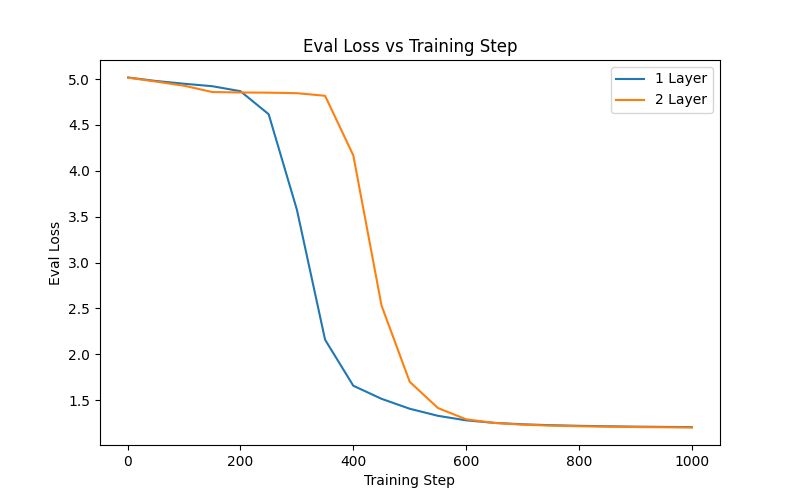
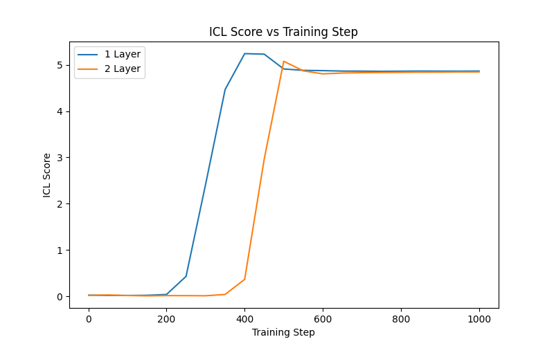

# In-context-Learning-Induction-Heads-V1
# Exploring Induction-Like Behavior in Tiny Transformers

## Overview

This project investigates whether small transformer language models can develop induction-like behavior when trained on repeated random sequences.

The motivation comes from Anthropic's work on induction heads and in-context learning. Before analyzing larger pretrained models such as Pythia, this project uses a tiny transformer setup to build intuition about repeated-token prediction, in-context learning, and attention behavior.

This is not a full reproduction of the Anthropic induction-head results yet. Instead, it is the first stage of a larger project: testing whether small models trained from scratch can develop induction-like behavior on simple synthetic data.

## Project Goals

* Implement a small transformer language model from scratch in PyTorch.
* Generate synthetic repeated-sequence training data.
* Measure in-context learning behavior during training.
* Compare 1-layer and 2-layer transformer models.
* Inspect attention patterns to understand what the models learned.
* Use these toy experiments as preparation for analyzing larger pretrained models such as Pythia.

## Dataset

Training examples are randomly generated token patterns repeated multiple times.

Example:

A B C D E ...
A B C D E ...
A B C D E ...
A B C D E ...

A new random pattern is generated for every training batch. This prevents the model from simply memorizing one fixed sequence.

The evaluation set is also made of repeated random sequences, but it is generated once and kept fixed across training checkpoints. This lets us measure whether the model improves on held-out repeated patterns over time.

## Methodology

Two models were trained:

* 1-layer transformer
* 2-layer transformer

Both models used causal self-attention and were trained with next-token prediction.

During training, the following metrics were tracked:

train_loss
eval_loss
loss_early
loss_late
icl_score

The ICL score is defined as:

ICL score = early-position loss - late-position loss

A higher ICL score means the model is much better at predicting later tokens than earlier tokens, suggesting that it is using information from earlier parts of the sequence.

## Initial Hypotheses

Before running the experiments, I expected:

1. The repeated-sequence task would show induction-like behavior, but not necessarily the full induction-head circuit described by Anthropic because the model and dataset are very small.

2. The 2-layer transformer would significantly outperform the 1-layer transformer. Since induction heads are commonly described as relying on multi-layer interactions, I expected the additional layer to matter.

3. The 1-layer model might learn some local statistics, but would struggle to exploit repeated structure as effectively as the 2-layer model.

## Results

The results partially contradicted these expectations.

Both the 1-layer and 2-layer models successfully learned the repeated-sequence task. Surprisingly, the 1-layer model developed the capability earlier than the 2-layer model, although both models eventually converged to similar performance.

### Evaluation Loss

The evaluation loss drops sharply during training for both models. This indicates that the models are not simply fitting individual training batches; they are improving on the fixed held-out evaluation set.

### ICL Score

The ICL score shows a sudden jump during training. Early in training, the score remains near zero. Later, it rapidly increases, suggesting that the model has learned to exploit repeated structure in the sequence.

## Attention Analysis

After training, attention patterns were inspected manually.

For a repeated sequence, query position 100 needed to predict the next token from the repeated pattern. Several attention heads strongly attended to an earlier position containing the correct continuation token.

When the query position was changed from 100 to 101, the dominant attention target shifted as well.

Example:

Query position 100 -> attention focuses on earlier answer position 5

Query position 101 -> attention focuses on earlier answer position 6

This suggests that the model is not fixated on one arbitrary position. Instead, attention appears to move with the repeated pattern structure and retrieve useful continuation tokens from earlier copies.

## Key Findings

Both 1-layer and 2-layer transformers learned to exploit repeated random sequences.
The 1-layer model learned earlier than expected.
The models generalized to held-out repeated patterns.
Attention heads retrieved continuation tokens from earlier copies of the sequence.
The behavior is induction-like, but does not yet isolate the classical two-layer induction-head circuit.
The synthetic task is likely simple enough that a 1-layer repetition-copying strategy can solve it.

## Interpretation

The models appear to learn a repetition-retrieval strategy.

Instead of memorizing fixed token mappings like:

25 -> 100

the model learns a more general rule:

When a pattern repeats, use earlier copies to predict later tokens.

This explains why the models perform well on the evaluation set even though the exact token patterns differ from the training batches.

However, because the 1-layer model solves the task effectively, this setup does not prove that the model has developed the exact induction-head mechanism described by Anthropic. A more difficult dataset is needed to separate simple repetition-copying from the classical induction-head circuit.

## Future Work

Next steps:

Design a harder synthetic dataset that prevents simple repetition-copying shortcuts.
Test whether 1-layer models fail while 2-layer models succeed on a more induction-specific task.
Save and visualize attention maps automatically.
Analyze Pythia checkpoints to study induction behavior in larger pretrained models.
Compare toy-model behavior with larger-model behavior.

## Repository Structure

src/

├── data.py

├── main.py

└── train.py

metrics_1layer.json
metrics_2layer.json

eval_loss.png
icl_score.png

## Status

This is Version 1 of the project.

The toy model experiments are complete enough to show induction-like repeated-sequence behavior. The next stage is to move toward larger pretrained model analysis, especially Pythia checkpoints, and compare these toy findings against larger-scale transformer behavior.
